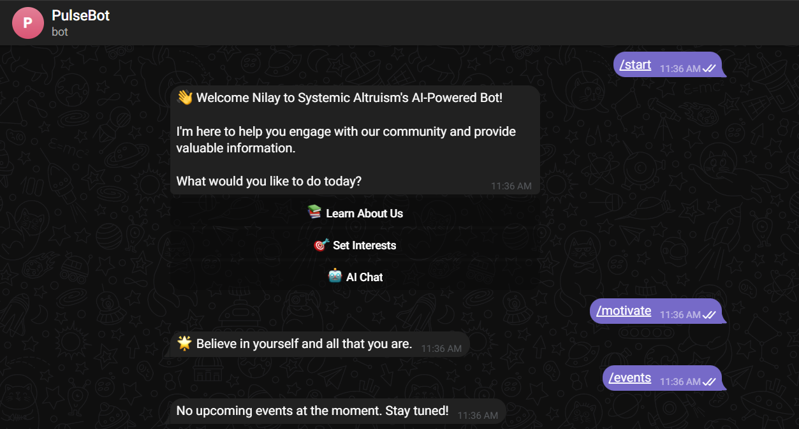

# Systemic Altruism Community Management Bot



## 📱 Overview

The Systemic Altruism Community Management Bot is an AI-powered Telegram bot designed to enhance community engagement, automate administrative tasks, and provide personalized user experiences. Leveraging OpenAI's API for intelligent interactions and Firebase for secure data management, the bot is built with `telebot` and deployed using `Flask` for optimal performance.

## ✨ Key Features

### Core Community Management

- **Intelligent Onboarding**: Sends personalized welcome messages with community guidelines
- **Smart FAQ System**: AI-powered responses to common queries
- **Automated Replies**: Context-aware responses to user inquiries
- **Admin Dashboard**: Commands and analytics for community managers

### Advanced Event Management & Registration System

- **Event Creation & Management**: Schedule and manage events
- **Smart RSVP System**: Automated registration with confirmation messages
- **Attendance Tracking**: Real-time participant lists with export functionality
- **Post-Event Feedback**: Automated surveys and analytics
- **Reminder System**: Scheduled event notifications

### AI-Powered Content Personalization

- **User Interest Profiling**: Analyzes interactions for personalized recommendations
- **Content Delivery**: Tailors updates based on user preferences
- **Discussion Suggestions**: Suggests relevant topics and events
- **Engagement Optimization**: Determines optimal times for notifications
- **A/B Testing Framework**: Evaluates different content strategies

### Community Insights & Analytics

- **Real-time Analytics**: Tracks engagement trends
- **Sentiment Analysis**: Monitors user sentiment on key topics
- **Topic Modeling**: Detects trending discussions
- **Member Network Mapping**: Visualizes community connections
- **Predictive Engagement Metrics**: Forecasts participation trends

### Additional Features

- **AI-Generated Motivational Messages**: Sends daily inspiration
- **Gamification System**: Rewards participation with badges and leaderboards
- **Community Polls & Voting**: Automates surveys and polls

## 🛠️ Technology Stack

- **Bot Framework**: `telebot`
- **AI & NLP**: OpenAI API
- **Backend & Server**: Flask
- **Database**: Firebase Firestore via `firebase-admin`
- **Environment Management**: `python-dotenv`
- **Image Processing**: Pillow
- **HTTP Requests**: Requests
- **Logging & Debugging**: Logging module

## 🚀 Installation & Setup

### Prerequisites

- Python 3.8+
- Telegram Bot Token (from BotFather)
- OpenAI API key
- Firebase project

### Environment Variables

Create a `.env` file with the following variables:

```ini
TELEGRAM_BOT_TOKEN=your_telegram_bot_token
OPENAI_API_KEY=your_openai_api_key
FIREBASE_CREDENTIALS_PATH=path_to_your_firebase_credentials.json
```

### Installation Steps

1. Clone the repository:

```bash
git clone https://github.com/nilaygit-10721/TelegramBot.git
cd systemic-altruism-bot
```

2. Install dependencies:

```bash
pip install -r requirements.txt
```

3. Run the bot locally:

```bash
python bot.py
```

## 📊 System Architecture

```
┌─────────────┐     ┌─────────────┐     ┌─────────────┐
│  Telegram   │────▶│    Bot      │────▶│   OpenAI    │
│  Platform   │◀────│   Server    │◀────│     API     │
└─────────────┘     └──────┬──────┘     └─────────────┘
                          │
                          ▼
                    ┌─────────────┐
                    │  Firebase   │
                    │  Database   │
                    └─────────────┘
```

## 🚢 Deployment

The bot is deployed using Flask for production reliability:

1. Deploy on a server (e.g., AWS, Render, or DigitalOcean)
2. Configure environment variables on the server
3. Start the bot using:

```bash
python main.py
```

## 🧪 Testing

Run tests to ensure functionality:

```bash
pytest
```

## 📈 Future Roadmap

- **Multilingual Support**
- **Voice Message Processing**
- **API Integrations**
- **Enhanced Analytics**
- **Configurable AI Personality Traits**

## 👥 Contributing

Contributions are welcome! Follow these steps:

1. Fork the repository
2. Create a new branch (`git checkout -b feature/new-feature`)
3. Commit your changes (`git commit -m 'Add new feature'`)
4. Push to your branch (`git push origin feature/new-feature`)
5. Open a Pull Request

## 📄 License

This project is licensed under the MIT License.
